# 링글 1차 코딩 과제 : 수강 신청 API
## 💻 실행 방법
1. .env 파일 생성

2. .env 파일 값 기입

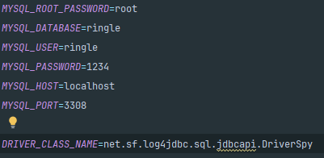

3. Docker Desktop 실행

4. docker-compose.yml의 상위 폴더에서 docker compose up --build 명령어 실행

5. SpringBoot Project 실행

## 📰 설계 배경
1. ERD : https://www.erdcloud.com/d/GXn4ewWTTXd7icWHj

## 📍 코드 설명
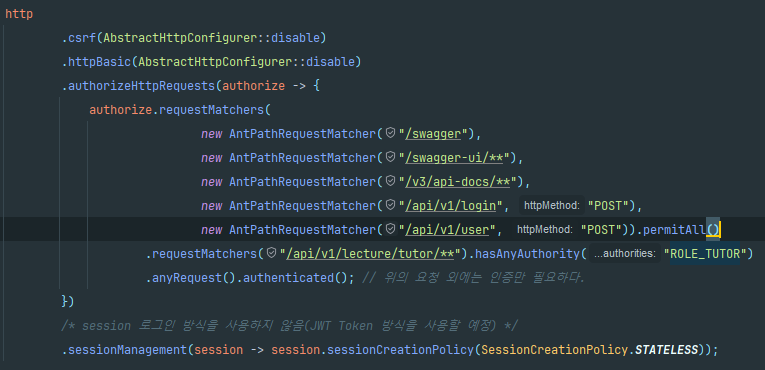
튜터만 행할 수 있는 수업을 만드는 행위는 /api/v1/tutor/ 하위 엔드포인트에 적용시켜 권한이 존재할 경우 실행하도록 설정

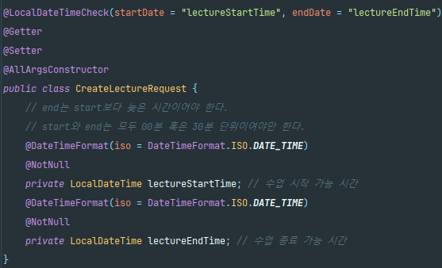
LocalDate 혹은 LocalDateTime의 startDate와 endDate의 크기와 같은 내용을 검증하는 경우
@LocalDateTimeCheck 어노테이션을 사용하여 공통으로 검증할 수 있도록 처리
(30분 단위가 아니거나, 시작 시간이 종료 시간보다 클 경우 오류 발생)

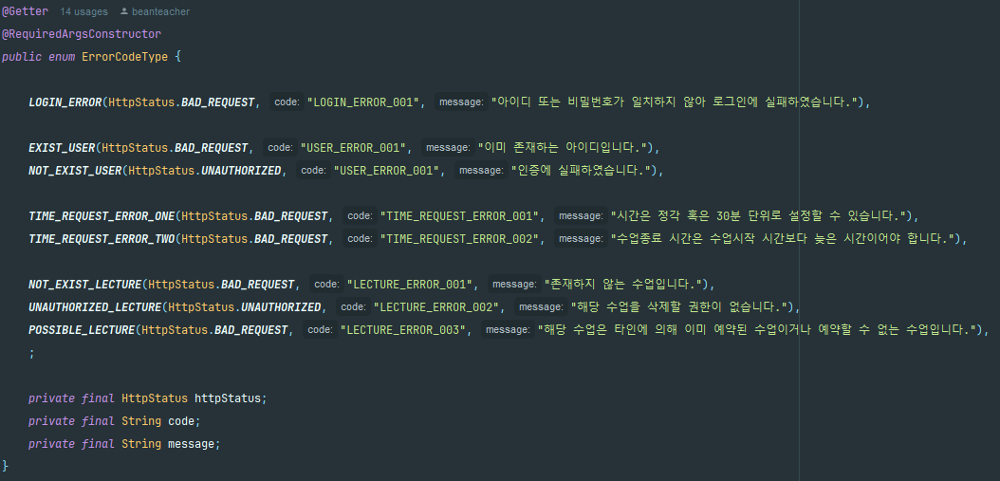
GlobalExceptionHandler에서 CustomException 발생 시 ErrorCodeType에 맞는 해당 오류를 반환하게끔 설정

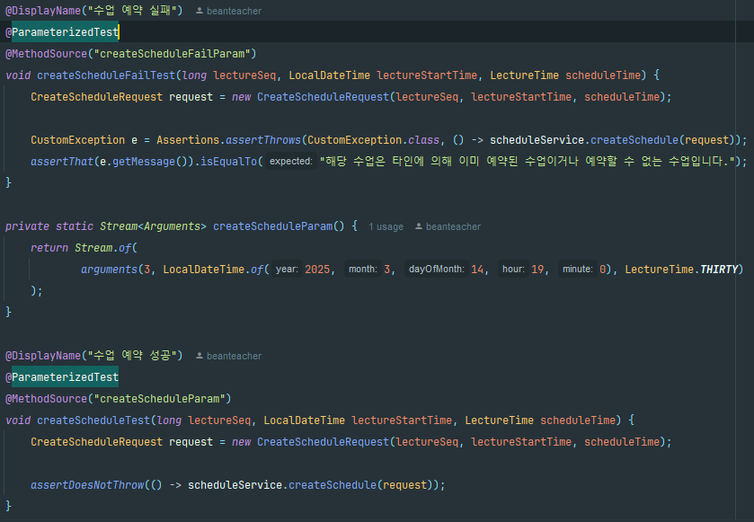
코드 실패 시와 성공 시의 테스트 코드 작성

## ⚠️ 구현된 코드 테스트 방법

### 포스트맨을 이용한 테스트

1. 회원 가입 진행 (USER_ROLE은 'ROLE_TUTOR', 'ROLE_STUDENT')를 사용할 수 있다.
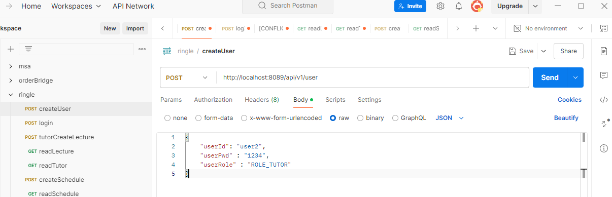

2. 로그인 진행
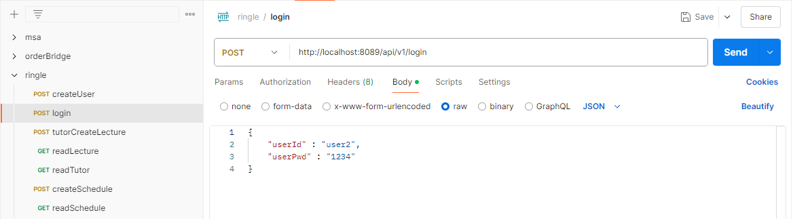
로그인 성공 시 token 값을 복사한 뒤
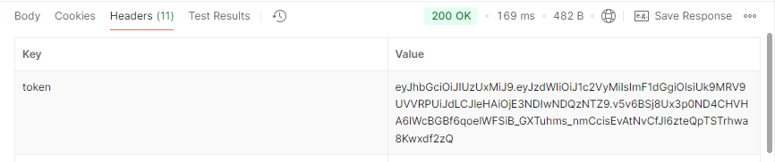
아래와 같이 Bearer Token에 값을 붙여넣기
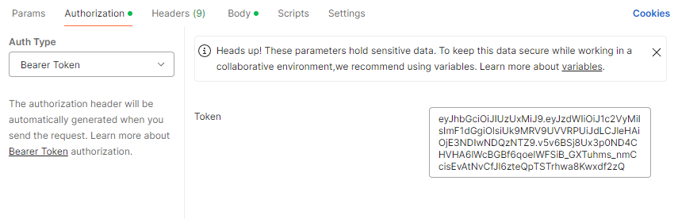

3. GET Mapping의 경우 파라미터에 맞는 값을 입력한 뒤 테스트 진행
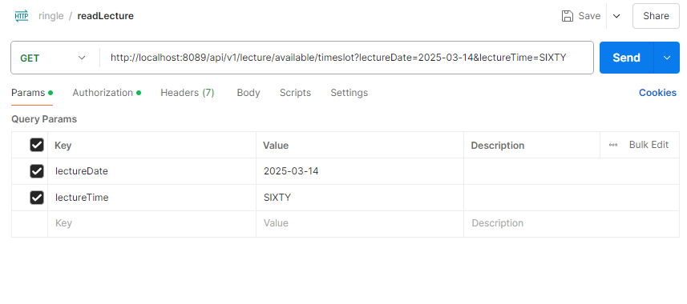

4. POST Mapping의 경우 파라미터에 맞는 JSON 문자열을 입력한 뒤 테스트 진행
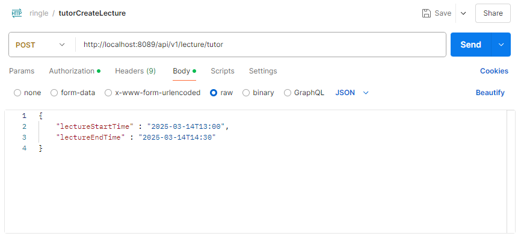

### 스웨거를 이용한 테스트
1. localhost:8089/swagger URL을 입력하여 스웨거 API 테스트를 할 수 있는 페이지 입장
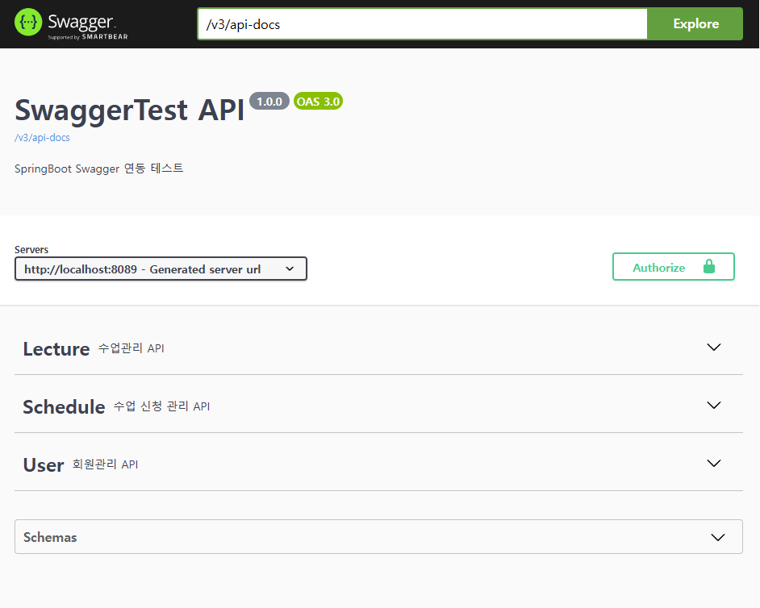

2. 로그인은 따로 엔드포인트가 구현되어 있지 않아 스웨거에 존재하지 않습니다. -> 포스트맨을 통해 로그인하여 Token 값을 복사한 뒤 Authorize 버튼 클릭 후
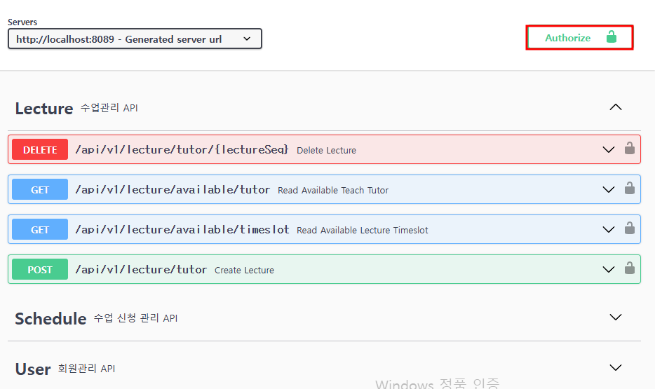
아래와 같이 토큰 값 전체 붙여넣기
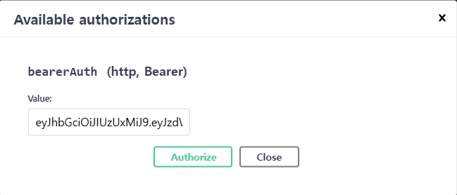

3. 스웨거에서 제공해주는 파라미터에 맞게 올바르게 값을 전달하여 테스트 진행
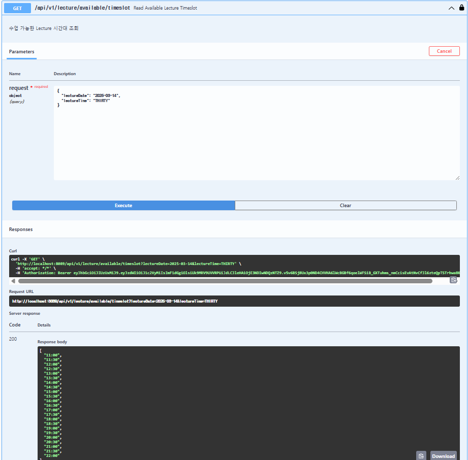